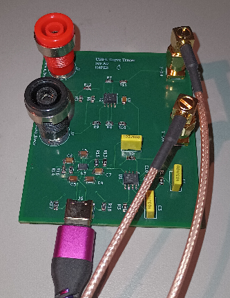
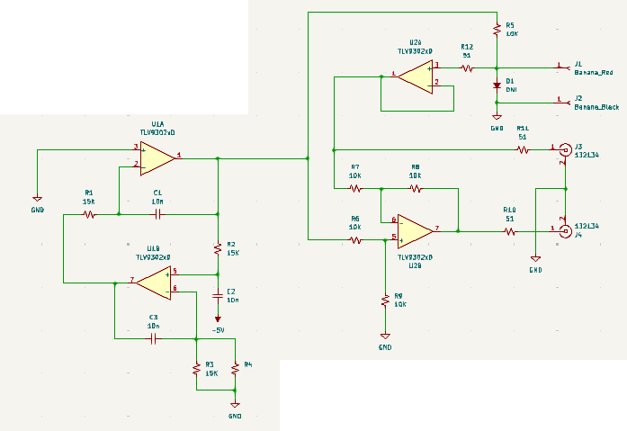
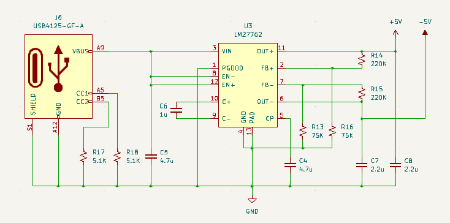
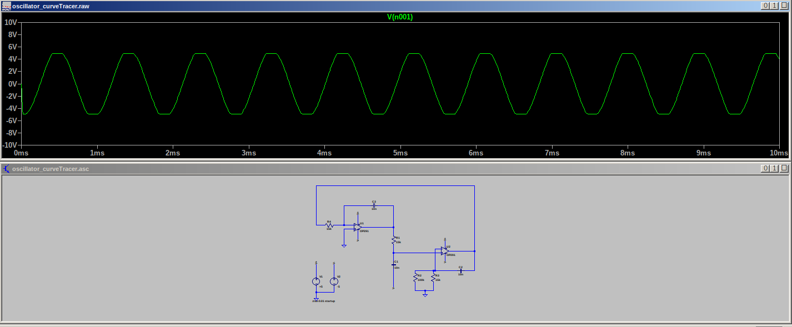

# CURVE_TRACER_USB-C
Curve tracer powered by +5V USB from the oscilloscope under use. 

Most curve tracer designs require using a transformer connected to line voltage. While simple, this setup is bulky, using components that are not readily available (at least not for me). This design is powered by the USB connection present on modern oscilloscopes, aiming for convenience at the cost of complexity. Additionally, most components are cheap and easily sourced. 

# Design

The waveforming portion of the design was inspired by a forum post: https://www.mikrocontroller.net/topic/528893

As explained in the post, the design uses op-amps to generate a 1KHz sinewave. This sinewave is put across the DUT, connected in using the banana jacks. The resulting sinewave is then sent to an oscilloscope configured to X-Y mode, with J3 connected to the X channel and J4 connected to the Y channel. Different components produce different waveforms, providing information on how the components function in the circuit, helpful in troubleshooting potential failures. 

More information can be found here on how the circuit is intended to work: [Octopus](article_octopus.pdf)

The power supply is an original design, based on the LM27762 switchmode supply that incorporates a linear regulator for both positive and negative rails. It uses a USB-C connector for +5V input voltage, allowing power to be drawn from the USB connection on the oscilloscope. In the future, I will likely move to a different power supply chip, as this chip does not produce the same positive and negative voltage when using the same value of bias resistors for each feedback pin. This does not impact function in this design, but it is an odd design quirk of the chip that would be problematic in most designs that require balanced voltage rails. 

# Manufacturing

PWAs can be ordered using the supplied gerber files: [Gerbers](gerbers_revA0.zip)

Components in the BOM can be sourced from Digikey, but most of the these components are readily available in kits from Amazon: [BOM](BOM_rA01.csv)

- D1 should not be installed. My german is a little rusty, I did not understand from the forum post that the shown diode was just intended for testing purposes. 
- The design calls for SMA connectors at J3 and J4. This is not necessary for the frequencies present, I just happened to have SMA to BNC cables that I wanted to use with this design. If you would prefer to save the cost of SMA connectors, wires could be soldered here instead, requiring use of BNC to alligator or minigrabber cables to take a reading.
- The design calls for Banana jacks at J1 and J2. The holes are sized to allow the screw terminal to be fastened to the copper on the vias. This allows for probes with shrouded banana plugs (such as found with most DMMs) to be used to probe components on a PWA. To keep down cost, probes could be soldered to these points instead.

# Additional thoughts/issues

The circuit as designed is perfectly functional as a curve tracer. However, I see various points for future improvement.

- As mentioned in the design portion, the voltage generated by the power supply is not the same on the positive and negative rails when using the same bias resistors. Irritatingly, the offset is small enough that it would be difficult to balance these voltages using standard resistors. In the future, I would prefer using a design with voltages balanced around 0V.
- The oscillator has clipping at the positive and negative rails. This can be seen even when simulating the design in LTSpice and is independent of the rail voltage. While this doesn't prevent the circuit from functioning, the non-ideal sine wave results in X-Y plots that appear misshapen when compared to the standard design. 

